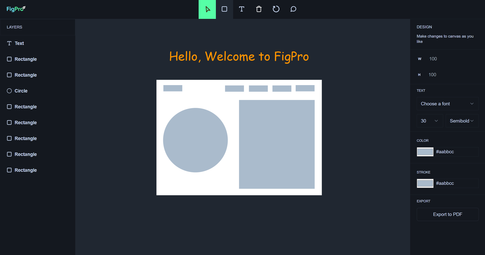

# FigPro: Collaborative Design Canvas ✨

[](https://figpro-dv192.vercel.app/)

Design together in real-time with **FigPro**! This Figma-inspired app lets you collaborate with friends using chat, reactions, and cursors. Create stunning designs with built-in shapes, image uploads, and freehand drawing tools. Boost your workflow with undo/redo, comments, and keyboard shortcuts. Manage your canvas with ease - scale, move, delete elements, or clear the workspace. Finally, export your masterpiece for everyone to see! Built with cutting-edge web tech (Next.js, TypeScript, Liveblocks, Fabric.js, Tailwind CSS). Bring your design ideas to life, collaboratively, with FigPro!

## Key Features:

- **Real-time Collaboration**: 
  - Multi-user cursors with cursor chat and reactions for seamless communication.
  - Live updates of design changes for all participants.
- **Design Tools**: 
  - Create various shapes using the built-in library.
  - Upload images for richer design elements.
  - Freehand drawing for artistic expression.
- **Enhanced Design Workflow**: 
  - Undo/Redo functionality for flexibility in design decisions.
  - Comment bubbles to provide feedback on specific elements.
  - Keyboard shortcuts for efficient actions.
  - Design history for version control and project management.
- **Canvas Management**: 
  - Delete, scale, and move design elements with ease.
  - Clear the canvas for a fresh start.
  - Export your final design for external use.

## Built With

- [Next.js](https://nextjs.org/) (Frontend Framework)
- HTML & CSS (Structure and Styling)
- TypeScript (Interactivity)
- [Tailwind CSS](https://tailwindcss.com/) (Utility-First CSS Framework)
- [Liveblocks](https://liveblocks.io/) (Real-time Collaboration)
- [Fabric.js](http://fabricjs.com/) (Canvas Library)

## Getting Started

To get a local copy of this project up and running, follow these steps:

### Prerequisites

Make sure you have Node.js installed.

### Installation

Clone the repository and install dependencies.

```bash
git clone https://github.com/DV192/figpro.git
cd figpro
npm install
```

### Usage

Start the development server.

```bash
npm run dev
```

Visit http://localhost:3000 in your browser.

## Project Inspiration

This project was created by following the tutorial on [JavaScript Mastery YouTube Channel](https://www.youtube.com/@javascriptmastery). Special thanks to the creator for the guidance and inspiration.

## Deployment

This project is deployed on [Vercel](https://vercel.com/). Visit the live version [here](https://figpro-dv192.vercel.app/).
